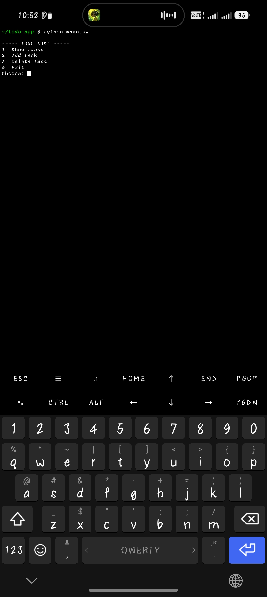

📝 Python Todo App

A simple command-line Todo List application built with Python.

✨ Features

- 📋 Show all tasks
- ➕ Add new tasks
- 🗑️ Delete tasks
- 💾 Save tasks automatically
- 📂 Load tasks from a text file
- 🖥️ Easy-to-use menu

📁 Project Structure

python-todo-app/
│── main.py
│── tasks.txt
│── README.md
│── .gitignore
│── LICENSE
└── requirements.txt

🚀 How to Run

python main.py

📸 Screenshot

## 📸 Screenshot

Example:

===== TODO LIST =====
1. Show Tasks
2. Add Task
3. Delete Task
4. Exit

🛠️ Built With

- Python 3

👨‍💻 Author

Ali Monem

GitHub: https://github.com/aliabdalmonem

---

⭐ If you like this project, don't forget to give it a star.
